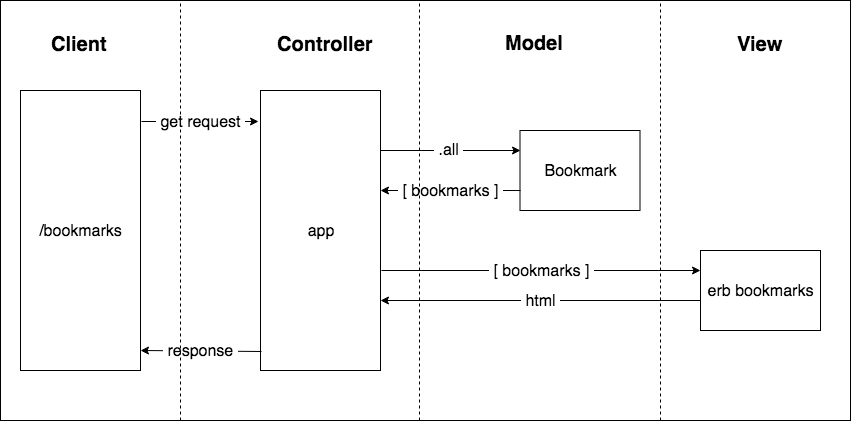

# Day 16 Notes

## Group call - Karsten_Katrina_Pete_Tom
* Easyish week
* Lots of food this weekend

## [Mocks Workshop](https://github.com/makersacademy/skills-workshops/tree/master/week-2/mocking_2)
What is the difference between Mocks, Doubles and Stubbs
#### Mocks
* Mocking is the practice and you use Doubles and Stubbs to do that
* Why do we mock? - If we have more than one class then we may not have access to it
* Makes your test independent by isolating them because - more specific tests, if you mock other classes you know the issue is with your class
* If working with an API - you don't want your tests to be dependant on it!

#### Double
* Double is a dummy object - placeholder
* Can add tags or behaviours

#### Stubbing
* Stubbing is where you need the object to respond in a specific way

## Kickoff
* Adding databases to the mix
* Debugging - Is the database returning the correct information or is my method requesting the wrong info
* All databases have a management system which structures how we organise and interact with all our stored data
* [CRUD](https://maggieappleton.com/databases):
 - Create
 - Read
 - Update
 - Delete

* SQL is the query language
* Postgres is the database

## SDL
#### DBMS come in two forms
1. Relational - SQL
 - organises data in columns(categories) and rows(single data entry)
 - highly structured and strict
 - Arrangement of table is called a Schema
 - Schema must be defined before entering data
2. Non-relational - No SQL
 - Umbrella term for anything that isn't relational
 - More flexible with less strictness around data types
 - Quick to set up and run as no schema required
 - Good for deploying accross decentralised distributed networks (stored accross many computers)

#### Top 5 DBMS
1. Oracle - Relational
2. MySQL - Relational
3. MicrosoftSQL - Relational
4. PostgreSQL - Relational
5. mongoDB - Non-relational

#### User stories
Guidelines:
```
As a <Stakeholder>,
So that <Motivation>,
I'd like <Task>.
```
Looks like:
```
As a conscientious software developer
So that I can understand the needs of the user and communicate effectively with my client
I'd like a recognized technique for capturing and defining requirements in plain English
```
[User stories .Gov](https://www.gov.uk/service-manual/agile-delivery/writing-user-stories)

#### Bookmark User Story 1
```
As a time-pressed user
So that I can quickly go to web sites I regularly visit
I would like to see a list of bookmarks
```

